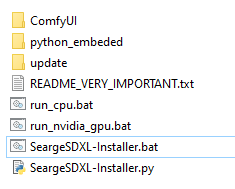
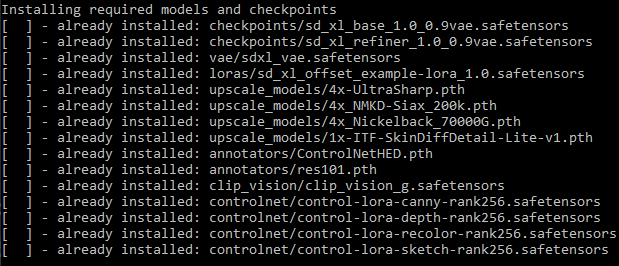

# Searge-SDXL: EVOLVED v4.x for ComfyUI

*Custom nodes extension* for [ComfyUI](https://github.com/comfyanonymous/ComfyUI),
**including a workflow** to use *SDXL 1.0* with both the *base and refiner* checkpoints.

# Table of Content

<!-- TOC -->
* [Searge-SDXL: EVOLVED v4.x for ComfyUI](#searge-sdxl-evolved-v4x-for-comfyui)
* [Table of Content](#table-of-content)
* [Version 4.1](#version-41)
    * [Always use the latest version of the workflow json file with the latest version of the custom nodes!](#always-use-the-latest-version-of-the-workflow-json-file-with-the-latest-version-of-the-custom-nodes)
* [Installing and Updating](#installing-and-updating)
  * [New and Recommended Installation (Windows)](#new-and-recommended-installation-windows)
  * [Manual Installation](#manual-installation)
    * [Alternative Installation (not recommended)](#alternative-installation-not-recommended)
  * [Updating an Existing Installation](#updating-an-existing-installation)
  * [Checkpoints and Models for these Workflows](#checkpoints-and-models-for-these-workflows)
    * [Description](#description)
    * [Direct Downloads](#direct-downloads)
* [Updates](#updates)
  * [What's new in v4.1?](#whats-new-in-v41)
    * [Bug Fixes](#bug-fixes)
    * [Other Changes](#other-changes)
  * [What's new in v4.0?](#whats-new-in-v40)
    * [Major Highlights](#major-highlights)
    * [Smaller Changes and Additions](#smaller-changes-and-additions-)
    * [What is missing in v4.0?](#what-is-missing-in-v40)
* [The Workflow File](#the-workflow-file)
  * [Documentation](#documentation)
* [Workflow Details](#workflow-details)
  * [Operating Modes](#operating-modes)
    * [Text to Image Mode](#text-to-image-mode)
    * [Image to Image Mode](#image-to-image-mode)
    * [Inpainting Mode](#inpainting-mode)
* [More Example Images](#more-example-images)
<!-- TOC -->

# Version 4.1

Instead of having separate workflows for different tasks, everything is integrated in **one workflow file**.

### Always use the latest version of the workflow json file with the latest version of the custom nodes!

# Installing and Updating

## New and Recommended Installation (Windows)

- For this to work properly, it needs to be used with the portable version of ComfyUI for Windows, read more about it
in the ComfyUI readme file 
- Download [this new install script](https://github.com/SeargeDP/SeargeSDXL/releases/download/v3.999/SeargeSDXL-Installer.zip)
and unpack it into the `ComfyUI_windows_portable` directory
- You should now have `SeargeSDXL-Installer.bat` and `SeargeSDXL-Installer.py` in the same directory as the ComfyUI
`run_cpu.bat` and `run_nvidia_gpu.bat`
- To verify that you are using the portable version, check if the directory `python_embeded` also exists in the same
directory that you unpacked these install scripts to
- Run the `SeargeSDXL-Installer.bat` script and follow the instructions on screen

## Manual Installation

- If you are not using the install script, you have to run the command `python -m pip install opencv-python` in the
python environment for ComfyUI at least once, to install a required dependency
- Navigate to your `ComfyUI/custom_nodes/` directory
- Open a command line window in the *custom_nodes* directory
- Run `git clone https://github.com/SeargeDP/SeargeSDXL.git`
- Restart ComfyUI

### Alternative Installation (not recommended)

- Download and unpack the latest release from the [Searge SDXL CivitAI page](https://civitai.com/models/111463)
- Drop the `SeargeSDXL` folder into the `ComfyUI/custom_nodes` directory and restart ComfyUI.

## Updating an Existing Installation

- Navigate to your `ComfyUI/custom_nodes/` directory
- If you installed via `git clone` before
  - Open a command line window in the *custom_nodes* directory
  - Run `git pull`
- If you installed from a zip file
  - Unpack the `SeargeSDXL` folder from the latest release into `ComfyUI/custom_nodes`, overwrite existing files
- Restart ComfyUI

## Checkpoints and Models for these Workflows

**These can now also be installed with the new install script (on Windows)** instead of manually downloading them.

### Description

This workflow depends on certain checkpoint files to be installed in ComfyUI, here is a list of the necessary
files that the workflow expects to be available.

If any of the mentioned folders does not exist in `ComfyUI/models`, **create** the missing folder and put the
downloaded file into it.

I recommend to **download and copy all** these files *(the required, recommended, and optional ones)* to make
**full use of all features** included in the workflow!

### Direct Downloads

(from Huggingface)

- **(required)** download [SDXL 1.0 Base with 0.9 VAE (7 GB)](https://huggingface.co/stabilityai/stable-diffusion-xl-base-1.0/resolve/main/sd_xl_base_1.0_0.9vae.safetensors)
and copy it into `ComfyUI/models/checkpoints`
  - *(this should be pre-selected as the base model on the workflow already)*

- **(recommended)** download [SDXL 1.0 Refiner with 0.9 VAE (6 GB)](https://huggingface.co/stabilityai/stable-diffusion-xl-refiner-1.0/resolve/main/sd_xl_refiner_1.0_0.9vae.safetensors)
and copy it into `ComfyUI/models/checkpoints`
  - *(you should select this as the refiner model on the workflow)*

- *(optional)* download [Fixed SDXL 0.9 vae (335 MB)](https://huggingface.co/madebyollin/sdxl-vae-fp16-fix/resolve/main/sdxl_vae.safetensors)
and copy it into `ComfyUI/models/vae`
  - *(instead of using the VAE that's embedded in SDXL 1.0, this one has been fixed to work in fp16 and should
**fix the issue with generating black images**)*

- *(optional)* download [SDXL Offset Noise LoRA (50 MB)](https://huggingface.co/stabilityai/stable-diffusion-xl-base-1.0/resolve/main/sd_xl_offset_example-lora_1.0.safetensors)
and copy it into `ComfyUI/models/loras`
  - *(the example lora that was released alongside SDXL 1.0, it can add more contrast through offset-noise)*
 

- **(recommended)** download [4x-UltraSharp (67 MB)](https://huggingface.co/uwg/upscaler/resolve/main/ESRGAN/4x-UltraSharp.pth)
and copy it into `ComfyUI/models/upscale_models`
  - *(you should select this as the primary upscaler on the workflow)*
 

- **(recommended)** download [4x_NMKD-Siax_200k (67 MB)](https://huggingface.co/uwg/upscaler/resolve/main/ESRGAN/4x_NMKD-Siax_200k.pth)
and copy it into `ComfyUI/models/upscale_models`
  - *(you should select this as the secondary upscaler on the workflow)*

- **(recommended)** download [4x_Nickelback_70000G (67 MB)](https://huggingface.co/uwg/upscaler/resolve/main/ESRGAN/4x_Nickelback_70000G.pth)
and copy it into `ComfyUI/models/upscale_models`
  - *(you should select this as the high-res upscaler on the workflow)*

- *(optional)* download [1x-ITF-SkinDiffDetail-Lite-v1 (20 MB)](https://huggingface.co/uwg/upscaler/resolve/main/ESRGAN/1x-ITF-SkinDiffDetail-Lite-v1.pth)
and copy it into `ComfyUI/models/upscale_models`
  - *(you can select this as the detail processor on the workflow)*

- **(required)** download [ControlNetHED (30 MB)](https://huggingface.co/lllyasviel/Annotators/resolve/main/ControlNetHED.pth)
and copy it into `ComfyUI/models/annotators`
  - *(this will be used by the controlnet nodes)*

- **(required)** download [res101 (531 MB)](https://huggingface.co/lllyasviel/Annotators/resolve/main/res101.pth)
and copy it into `ComfyUI/models/annotators`
  - *(this will be used by the controlnet nodes)*

- **(recommended)** download [clip_vision_g (3.7 GB)](https://huggingface.co/stabilityai/control-lora/resolve/main/revision/clip_vision_g.safetensors)
and copy it into `ComfyUI/models/clip_vision`
  - *(you should select this as the clip vision model on the workflow)*

- **(recommended)** download [control-lora-canny-rank256 (774 MB)](https://huggingface.co/stabilityai/control-lora/resolve/main/control-LoRAs-rank256/control-lora-canny-rank256.safetensors)
and copy it into `ComfyUI/models/controlnet`
  - *(you should select this as the canny checkpoint on the workflow)*

- **(recommended)** download [control-lora-depth-rank256 (774 MB)](https://huggingface.co/stabilityai/control-lora/resolve/main/control-LoRAs-rank256/control-lora-depth-rank256.safetensors)
and copy it into `ComfyUI/models/controlnet`
  - *(you should select this as the depth checkpoint on the workflow)*

- **(recommended)** download [control-lora-recolor-rank256 (774 MB)](https://huggingface.co/stabilityai/control-lora/resolve/main/control-LoRAs-rank256/control-lora-recolor-rank256.safetensors)
and copy it into `ComfyUI/models/controlnet`
  - *(you should select this as the recolor checkpoint on the workflow)*

- **(recommended)** download [control-lora-sketch-rank256 (774 MB)](https://huggingface.co/stabilityai/control-lora/resolve/main/control-LoRAs-rank256/control-lora-sketch-rank256.safetensors)
and copy it into `ComfyUI/models/controlnet`
  - *(you should select this as the sketch checkpoint on the workflow)*

Now everything should be prepared, but you may to have to adjust some file names in the different model selector boxes
on the workflow. Do so by clicking on the filename in the workflow UI and selecting the correct file from the list.

# Updates

Find information about the latest changes here.

## What's new in v4.1?
This update contains bug fixes that address issues found after v4.0 was released.

### Bug Fixes
- The high resolution latent detailer was not properly set up in the processing pipeline and did nothing
- The debug printer node was broken - I didn't notice that because it was not connected in any of the v4.0 workflows
- A bug related to generating with batch sizes larger than 1 has been fixed, it's now working properly

### Other Changes
- The images in the `examples` folder have been updated to embed the v4.1 workflow

## What's new in v4.0?
This is the first release with the v4.x architecture of the custom node extension.

### Major Highlights
- A **complete re-write** of the custom node extension and the SDXL workflow 
- **Highly optimized** processing pipeline, now **up to 20% faster** than in older workflow versions
- Support for **Controlnet and Revision**, up to 5 can be applied together
- **Multi-LoRA** support with up to 5 LoRA's at once
- **Better Image Quality** in many cases, some improvements to the SDXL sampler were made that can produce images
with higher quality
- Improved **High Resolution** modes that replace the old "Hi-Res Fix" and should generate better images

### Smaller Changes and Additions 
- Workflows created with this extension and metadata embeddings in generated images are forward-compatible with
future updates of this project
- The custom node extension included in this project is backward-compatible with every workflow since version v3.3
- A text file can be saved next to generated images that contains all the settings used to generate the images

### What is missing in v4.0?
Some features that were originally in v3.4 or planned for v4.x were not included in the v4.0 release, they are
now planned for v4.1. This was decided to get this new version released earlier and the missing features should
not be important for 99% of users.

So, what is actually missing?

- Prompt Styling - (new) the ability to load styles from a template file and apply them to prompts
- Prompting Modes - (from v3.4) More advanced prompting modes, the modes from v3.4 will be re-implemented and a more
flexible system to create custom prompting modes will be added on top of it
- Condition Mixing - (new) This was part of the prompting modes in v3.4 but in v4.x it will be exposed in a more
flexible way as a separate module

 

*(5 multi-purpose image inputs for revision and controlnet)*

# The Workflow File

The workflow is included as a `.json` file in the `workflow` folder.

**After updating Searge SDXL, always make sure to load the latest version of the json file if you want to benefit
from the latest features, updates, and bugfixes.**

(you can check the version of the workflow that you are using by looking at the workflow information box)

## Documentation

[Click this link to see the documentation](docs/readme.md)

*(the main UI of the workflow)*

# Workflow Details

The **EVOLVED v4.x** workflow is a new workflow, created from scratch. It requires the latest additions to the
SeargeSDXL custom node extension, because it makes use of some new node types.

The interface for using this new workflow is also designed in a different way, with all parameters that
are usually tweaked to generate images tightly packed together. This should make it easier to have every
important element on the screen at the same time without scrolling.

*(more advanced UI elements right next to the main UI)*

## Operating Modes

### Text to Image Mode

In this mode you can generate images from text descriptions. The source image and the mask (next to the prompt inputs)
are not used in this mode.

*(example of using text-to-image in the workflow)*

 

*(result of the text-to-image example)*

### Image to Image Mode

In this mode you can generate images from text descriptions and a source image. The mask (next to the prompt inputs)
is not used in this mode.

*(example of using image-to-image in the workflow)*

 

*(result of the image-to-image example)*

### Inpainting Mode

In this mode you can generate images from text descriptions and a source image. Both, the source image and the mask
(next to the prompt inputs) are used in this mode.

This is similar to the image to image mode, but it also lets you define a mask for selective changes of only parts
of the image.

*(example of using inpainting in the workflow)*

 

*(result of the inpainting example)*

# More Example Images

A small collection of example images (with embedded workflow) can be found in the `examples` folder. [Here is an
overview of the included images.](examples/readme.md)
